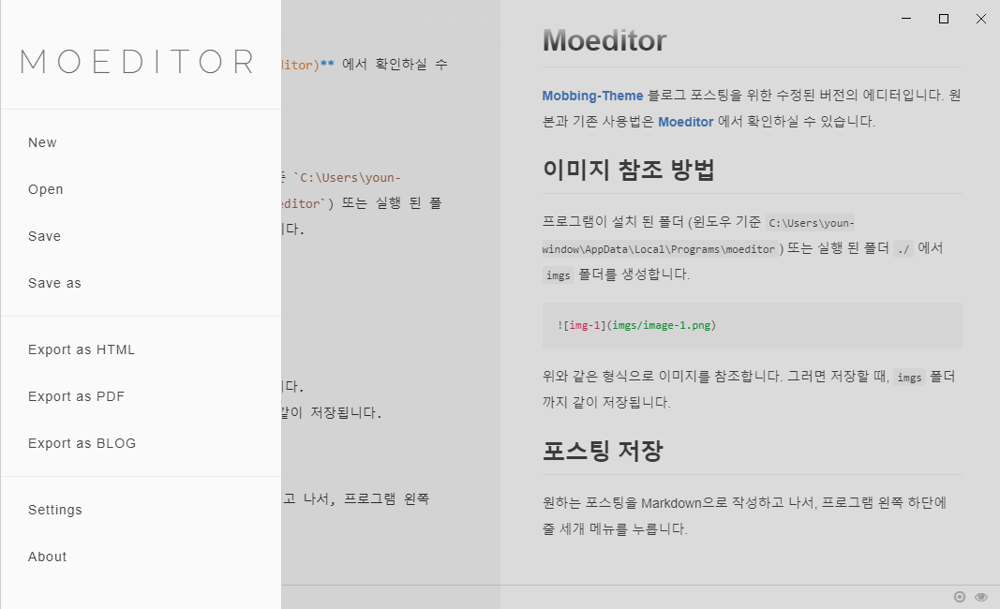
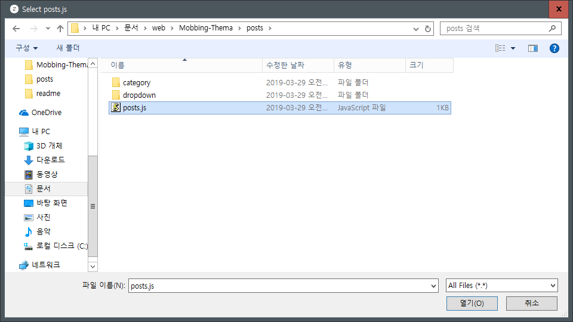
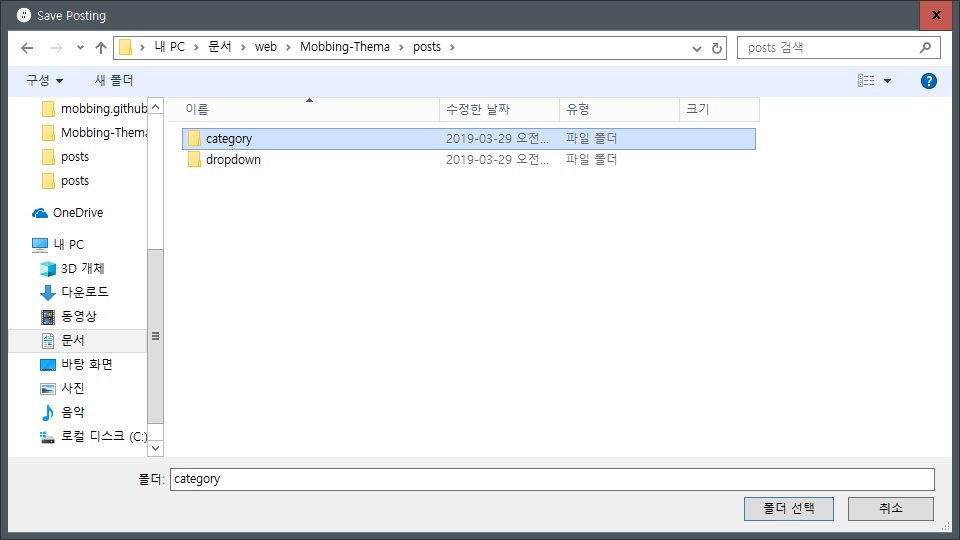

# Moeditor
**[Mobbing-Theme](https://github.com/mobbing/Mobbing-Theme)** 블로그 포스팅을 위한 수정된 버전의 에디터입니다. 원본과 기존 사용법은 **[Moeditor](https://github.com/Moeditor/Moeditor)** 에서 확인하실 수 있습니다.

## 이미지 참조 방법
프로그램이 설치 된 폴더 (윈도우 기준 `C:\Users\youn-window\AppData\Local\Programs\moeditor`) 또는 실행 된 폴더 `./` 에서 `imgs` 폴더를 생성합니다.

```md

```

위와 같은 형식으로 이미지를 참조합니다.
그러면 저장할 때, `imgs` 폴더까지 같이 저장됩니다.

## 포스팅 저장
원하는 포스팅을 Markdown으로 작성하고 나서, 프로그램 왼쪽 하단에 줄 세개 메뉴를 누릅니다.


**Exort as BLOG** 라는 메뉴를 클릭합니다.



처음에 posts.js를 선택하라는 창이 뜹니다. 관리하고 있는 블로그의 `/posts/posts.js`를 선택해 줍니다.



두 번째로 포스팅이 저장될 위치(카테고리) 폴더를 선택하라는 창이 뜹니다. 카테고리의 index.html이 관리되고 있는 폴더를 선택해 줍니다.

<br><br>

그러면 포스팅이 작성됩니다.


## 포스팅 마크다운 저장

Export as BLOG를 하면 프로젝트 최상위 폴더에 `md_posts`란 폴더 안에 저장이 됩니다. `md_posts` 폴더가 없으면 저장이 되지 않습니다.
